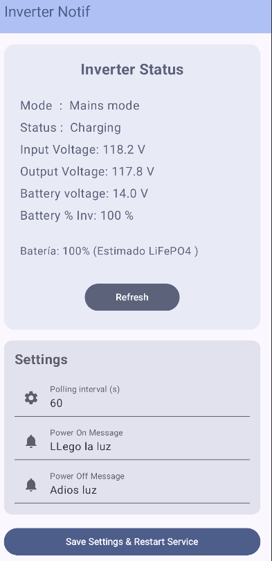

# InverterNotif

InverterNotif (Phase 2 inverter monitor ) is an Android application designed to monitor the status of solar inverters via the dessmonitor API. It provides real-time updates and notifications regarding power availability and battery levels, specifically optimized for LiFePO4 battery systems.

Inverter of tests: https://suennaelectronica.com/productos/inversor-phase-ii-lv-solar-1-2kw-120vac-12vdc-senoidal/

## Features

*   **Real-time Monitoring**: Fetches inverter parameters such as input voltage, battery voltage, and more using the ShineMonitor API.
*   **Power Status Notifications**: Notifies the user when power is restored ("Llegó la luz") or lost ("Adiós luz").
*   **LiFePO4 Battery Estimation**: Includes a sophisticated algorithm to estimate battery percentage based on voltage under moderate load, with support for 12V, 24V, and 48V systems.
*   **Background Service**: Runs a foreground service to ensure continuous monitoring even when the app is in the background.
*   **Configurable Settings**: 
    *   Customizable polling intervals.
    *   Personalized notification messages for power events.
    *   API credential management (Sign, Salt, and Token).
*   **Modern UI**: Built with Jetpack Compose for a responsive and clean user interface.

## How it Works

### Battery Estimation
The app uses a piece-wise linear interpolation algorithm to provide a more precise battery percentage. It is specifically tuned for the flat discharge curve of LiFePO4 batteries under load. If the inverter provides a Direct SOC (State of Charge) through the API, the app will prioritize that data.

### Background Service
The `InverterStatusService` handles all network requests and logic. It uses Coroutines for asynchronous tasks and Volley for networking. It broadcasts status updates to the `MainActivity` and triggers system notifications for critical events.

## Tech Stack

*   **Language**: Kotlin
*   **UI Framework**: Jetpack Compose
*   **Networking**: Volley
*   **Concurrency**: Kotlin Coroutines
*   **Persistence**: SharedPreferences

## Setup

1.  Clone the repository.
2.  Open the project in Android Studio.
3.  Configure your ShineMonitor API credentials in the app settings.
4.  Ensure the app has permission to show notifications.

## Screenshots

---
Developed as a utility for inverter monitoring and energy management.
